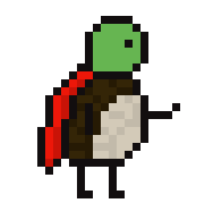
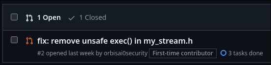

#+title: Haste Programming Language

Haste is a general-purpose programming language designed with a focus on game development and system programming. It’s built to reflect my own programming style and preferences. In many ways, Haste is simply the kind of language I would enjoy using. You might not agree with all of its design decisions, and that’s perfectly fine. After all, it’s shaped by my own philosophies.

#+begin_src haste
func main() do
  @println("Hello, World!"); // anything that starts with `@` is consider as macro expantion

  const mini_program = "++-++++** / * *";
  var result: fsize = 0;

  for ch in mini_program do
    match ch in
      case '+' do result += 1;
      case '-' do result -= 1;
      case '*' do result *= 2;
      case '/' do result /= 2;
      else // Ignore anything else
    end
  end

  @println("Result: {}", result);
end
#+end_src

* Inspirations
Haste is heavily inspired by C, Zig, and Odin, along with a few other languages. C is my all-time favorite, with Zig being a close second. Haste’s simplicity and low-level nature come from my background in C. I’ve never been a fan of C++ or its complexity, so Haste is designed to be closer in spirit to C and Zig. think of it as C with methods and a sane type system.

The idea of treating types as values is borrowed from Zig. I find this model ideal for reflection and it significantly simplifies the compiler’s implementation. From Odin, I drew inspiration from its type system, the =context= model and overall design philosophy, which encouraged me to focus on building the language I want, rather than trying to please everyone.

* Philosophy
1. *My Own Comfort and Enjoyment*:
   Haste is designed first and foremost to fit *me*. No programming language will ever perfectly match anyone’s personal taste (and no, that’s not narcissism. it’s just reality). Every programmer has their own preferences. So I’m building Haste to be the language I feel most comfortable using.
2. *Freedom*:
   By creating Haste, I guarantee myself the freedom to do whatever I want with it. I can make “stupid” design decisions and no one can stop me. If I want to make a Zig replica with overloading. so be it! If I want first-class JVM support; why not! It’s my playground.
   (Don’t worry, once the compiler and core language stabilize, I’m not going to pull the “breaking changes every week” move... besides, who’s even going to use this language anyway? 😄)
3. *Simplity*:
   I want to keep things simple so my head doesn’t explode from juggling too many concepts at once. Just a bunch of straightforward rules to rule the world. :3
4. *What People Think*: ...yeah, that’s intentionally last.

* The mascot (Turbo the Turtle)
This turtle was the first pixel art I made back in 2020, so I decided to make it Haste’s mascot. It’s special to me because it marks where it all started.
This turtle was my first ever pixel art I have done in 2020. thats why I want it to be the mascot as my first pixel art.

* Also it has more PRs/ISSUES than JAI

(its an AI slop)
